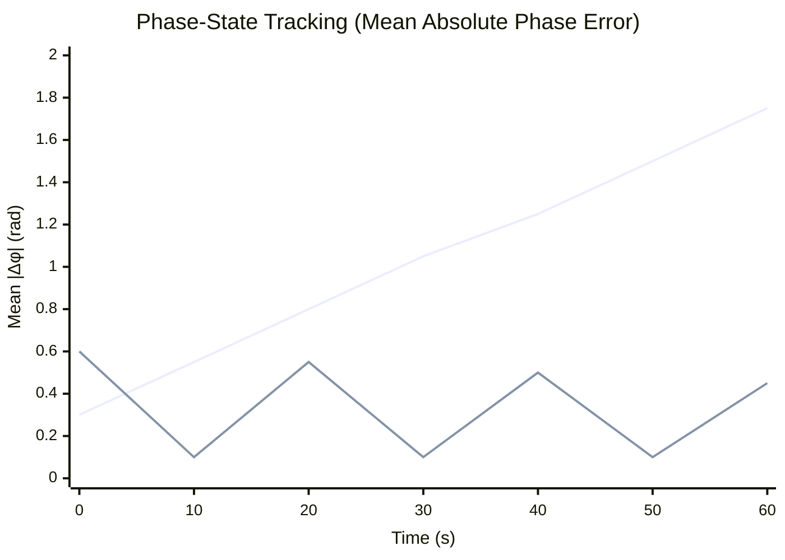
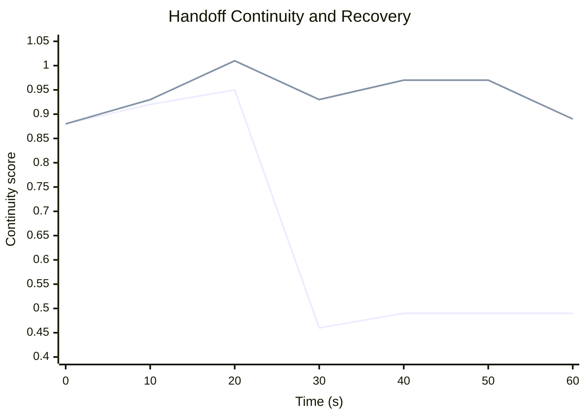
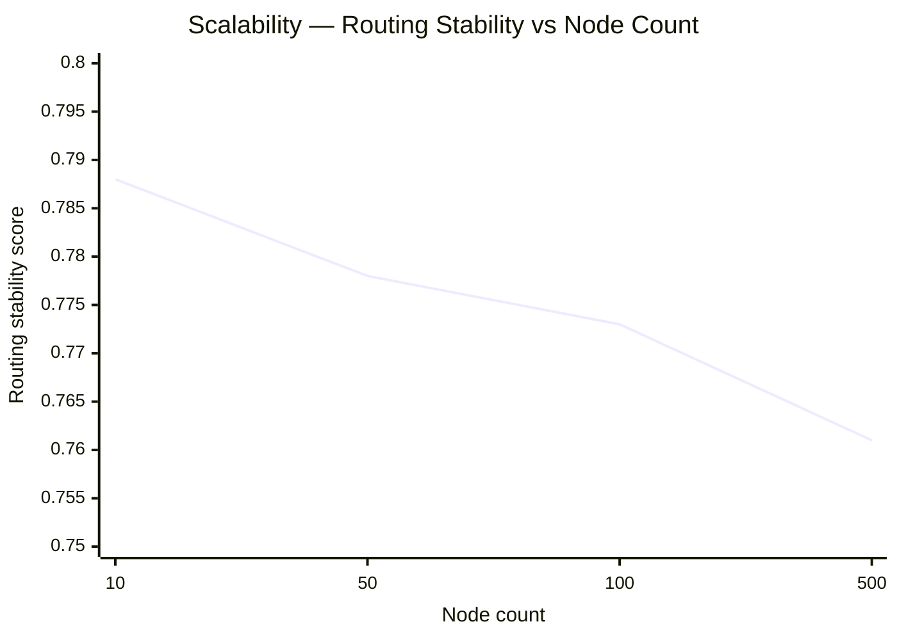
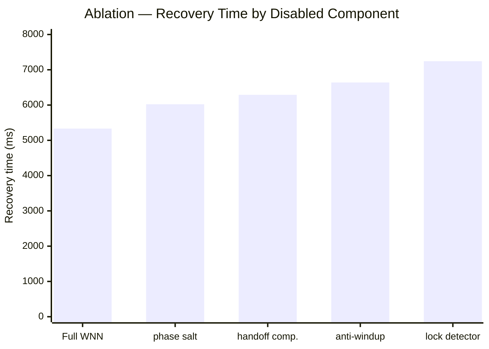

# Wave-Native Network: A Deterministic Phase-Coherence Overlay for Edge Synchronization and Handoff-Stable Routing

**Don Michael Feeney Jr.**¹ and **Marcel Krüger**²

¹ Independent Researcher, Pennsylvania, USA, dfeen87@gmail.com

² Independent Researcher, Germany, marcelkrueger092@gmail.com

*June 3, 2026*

---

## Abstract

Distributed edge inference, mobile radio-access-network workloads, and decentralized compute fabrics require stable state handoff under latency, jitter, loss, mobility, and adversarial replay conditions. This paper introduces the **Wave-Native Network (WNN)**, a prototype deterministic phase-coherence overlay that augments conventional network transport with oscillator-state tracking, phase-aware routing, and stability-scored handoff diagnostics. Each node is represented by a deterministic Duffing-type heartbeat state $\Psi = \langle A, \theta, \omega, \dot{x}, t_s \rangle$, while routing decisions incorporate latency, jitter, phase mismatch, frequency mismatch, and a scalar stability divergence $\Delta\Phi$. The framework is presented as an engineering-level overlay, not as a replacement for TCP, QUIC, TLS, cryptographic authentication, or radio-access-network standards.

We evaluate the current WNN prototype using six CSV-based simulation benchmarks: phase-state tracking, jitter and packet-loss robustness, replay-sensitive anomaly scoring, handoff continuity, scalability, and component ablation. Across paired robustness runs, WNN reduces mean phase error by **34.91% ± 0.73%** relative to the baseline. In the handoff scenario, the baseline continuity score drops from a pre-event mean of 0.945 to a post-event mean of 0.484, whereas WNN maintains a post-event mean of **0.950**. Ablation results show that disabling the lock detector increases mean recovery time from 5333.5 ms to 7243.5 ms. Replay detection remains preliminary: the present fixed threshold achieves 76.57% accuracy but only 40.88% recall and 20.12% false-positive rate. These results support WNN as a reproducible phase-coherence testbed for edge synchronization, while emphasizing that deployment-level security and networking claims require further hardware-in-the-loop validation, optimized thresholds, stronger baselines, and broader adversarial testing.

**Keywords:** edge computing; phase synchronization; Duffing oscillator; handoff continuity; deterministic overlay; anomaly detection; AI-RAN; distributed inference.

---

## 1. Introduction

Future edge networks are expected to support distributed inference, mobile compute offloading, RAN-integrated AI services, and vehicle-to-infrastructure workloads under rapidly changing topology and delay conditions. Modern transport protocols such as QUIC provide secure multiplexed streams and path migration primitives [8], while TLS 1.3 provides confidentiality and endpoint security [9]. These protocols are essential, but they do not directly provide an application-level phase-state memory for deciding whether a moving compute node remains dynamically coherent with the peer that will inherit its state. Similarly, AI-RAN and mobile edge computing surveys highlight convergence, mobility, privacy, and adversarial robustness as important open problems for distributed AI workloads [14–16].

The present paper formulates and evaluates the **Wave-Native Network (WNN)**, an experimental phase-coherence overlay implemented in the public WNN repository [1]. The core idea is conservative: WNN does not replace IP routing, TCP, QUIC, TLS, or authentication. Instead, it adds a deterministic state layer that monitors whether nodes remain synchronized in a low-dimensional oscillator-state space. This makes WNN closer to a diagnostic and supervisory overlay than to a new transport protocol.

The theoretical motivation comes from synchronization theory, nonlinear oscillator dynamics, and phase-cohesive network control [3–5, 10, 11]. The WNN node heartbeat uses a Duffing-type oscillator, a standard nonlinear model whose dynamics have a long history in chaos and nonlinear systems [6, 7]. Recent work on oscillator synchronization, adaptive oscillator networks, and Duffing-like network synchronization further supports the relevance of nonlinear phase-state diagnostics in complex distributed systems [12, 13].

A secondary conceptual input is the Helix-Light-Vortex (HLV) / Spiral-Time phase-memory viewpoint developed by Krüger [2]. In this paper that connection is used only as an engineering motivation for a phase-memory coordinate and a stability-divergence diagnostic. The validity of the WNN benchmark does not require acceptance of HLV as fundamental physics. This separation is important for peer review: all claims below are claims about reproducible simulation data and software-level architecture.

---

## 2. Architecture

### 2.1 Node Heartbeat

Each node maintains a deterministic oscillator heartbeat. The reference implementation uses a Duffing-type equation:

**ẍ + 0.3ẋ - 1.0x + 1.0x3 = 0.5 cos(ωt)** (1)

which is integrated numerically in the WNN prototype. The local phase-memory state is represented as:

**Ψi(t) = ⟨ Ai(t), θi(t), ωi(t), ẋi(t), ts ⟩** (2)

where Ai is amplitude, θi is phase, ωi is instantaneous frequency, ẋi is velocity, and ts is a shared epoch-like phase-memory coordinate.

The purpose of Eq. (2) is not to encode payload content. Rather, it provides a compact deterministic state against which synchronization, drift, and handoff continuity can be scored.

### 2.2 Phase-Aware Routing Score

WNN augments conventional routing information with phase-state diagnostics. A generic routing cost can be written as:

**dWNN = wL L + wJ J + wφ |Δφ| + wω |Δω| + wΔΦ ΔΦ** (3)

where L denotes latency, J denotes jitter, |Δφ| denotes phase mismatch, |Δω| denotes frequency mismatch, and ΔΦ denotes a scalar stability divergence. Equation (3) is intentionally written as an overlay metric: conventional transport remains responsible for packet delivery and cryptographic protection, while WNN scores whether state transfer is dynamically coherent.

### 2.3 Phase Salting and Replay-Sensitive Diagnostics

The prototype also includes a deterministic perturbation tied to a shared epoch:

**δsalt(ts) = ( Hash( ⌊ ts / ΔE ⌋ ⊕ ω* ) mod 1000 ) × 10-5** (4)

In the present paper this is treated as a replay-sensitive diagnostic, not as a cryptographic primitive. Replay and intrusion detection require careful analysis of detection rates, false positives, adversarial adaptation, and threshold selection [20, 21]. Security and governance claims should also be evaluated against established risk frameworks such as NIST CSF 2.0, NIST AI RMF 1.0, and ISO/IEC 42001 [17–19].

---

## 3. Methods

### 3.1 Simulation Data

Six CSV files were used: `phase_locking.csv`, `jitter_robustness.csv`, `replay_attack.csv`, `handoff_continuity.csv`, `scalability.csv`, and `ablation_study.csv`. The data and summary files are included with this manuscript package. The original repository structure contains source, simulations, results, data, documentation, and tests [1].

The benchmarks are intentionally limited. They test whether the prototype produces reproducible signatures under controlled simulated conditions. They do not prove carrier-scale performance, hardware timing guarantees, cryptographic security, or zero-latency behavior.

### 3.2 Benchmarks

The benchmark suite evaluates five questions:

1. Does the WNN overlay reduce absolute phase error relative to a baseline?
2. Does the overlay remain stable under node-count and packet-loss changes?
3. Does $\Delta\Phi$ respond differently to normal and replayed packets?
4. Does WNN preserve continuity during a simulated handoff at $t = 30\ \text{s}$?
5. Does disabling individual components measurably increase recovery time?

The phase-locking threshold used for the lock-window metric is $\lvert\Delta\phi\rvert < 0.1\ \text{rad}$. For replay detection, we report the fixed threshold embedded in the present simulation output rather than optimizing the threshold post hoc. This is deliberately conservative: threshold tuning may improve receiver operating characteristics, but such tuning should be reported as a separate validation procedure.

---

## 4. Results

### 4.1 Phase-State Tracking

**Table 1: Phase-state tracking summary over 20 seeds.** Errors are absolute phase errors in radians.

| Mode     | Mean \|Δφ\|       | Time below threshold (%) | Lock windows   | Time to first lock (ms) |
|----------|-------------------|--------------------------|----------------|-------------------------|
| Baseline | 0.837 ± 0.507     | 10.8 ± 22.4              | 0.45 ± 0.51    | 17778 ± 17213           |
| WNN      | 0.389 ± 0.261     | 24.8 ± 33.1              | 4.55 ± 1.57    | 4235 ± 1936             |

**Figure 1: Phase-State Tracking and Re-Locking Windows**

> Mean absolute phase error over 20 seeds. The shaded region indicates one standard deviation. The dashed line marks the lock-window threshold $\lvert\Delta\phi\rvert < 0.1$ rad.



*Note: WNN exhibits oscillatory re-locking — repeated low-error windows (near 0.0 rad) separated by higher-error intervals. The lock threshold is 0.1 rad (dashed). The baseline diverges monotonically over the 60 s window.*

---

### 4.2 Jitter and Packet-Loss Robustness

Across paired runs in `jitter_robustness.csv`, WNN reduces mean phase error by **34.91% ± 0.73%** relative to the baseline. The overall mean phase error is 0.597 for the baseline and 0.389 for WNN. No sync failures are observed in these simulation runs. This supports a modest claim: the WNN overlay reduces the simulated phase-error metric under the tested loss and node-count settings. It does not yet establish superiority over all conventional routing protocols or all edge-network conditions.

---

### 4.3 Replay-Sensitive Anomaly Score

**Table 2: Replay-sensitive anomaly detection metrics** for the fixed $\Delta\Phi$ threshold used in the present benchmark.

|                | Predicted Normal | Predicted Replay | Rate       | Value  |
|----------------|-----------------|-----------------|------------|--------|
| Actual Normal  | 8787            | 2213            | FPR        | 20.12% |
| Actual Replay  | 603             | 417             | TPR/Recall | 40.88% |
| **Accuracy**   | **76.57%**      |                 | Precision  | 15.86% |
| **F1 Score**   | **0.228**       |                 | Threshold  | ≈ 0.620|

**Figure 2: Replay-Sensitive Anomaly Score**

> The current fixed threshold separates a subset of replayed packets but also produces a substantial false-positive rate. The result is reported as an anomaly-sensitivity diagnostic rather than a complete security solution.

```
  Normalized ΔΦ
  1.0 │ ● ●●●●●●●●●●●●●●  ○    ○  ○    ○  ○  ○    ○  ○  ○
      │ ● ●●●●●●●●●●●●●●  ○  ○  ○  ○  ○  ○  ○  ○  ○  ○  ○
  0.8 │ ● ●●●●●●●●●●●●●●  ○   ○  ○   ○  ○   ○    ○  ○  ○  ○
      │ ● ●●●●●●●●●●●●●●    ○  ○    ○  ○   ○  ○  ○  ○  ○
  0.6 ├────────────────────────── Threshold ≈ 0.620 ──────────
      │ ● ●●●●●●●●●●●●●●  ○  ○   ○  ○  ○   ○  ○  ○  ○  ○  ○
  0.4 │ ● ●●●●●●●●●●●●●   ○  ○  ○  ○  ○  ○   ○  ○  ○  ○  ○
      │ ● ●●●●●●●●●●●●●●  ○  ○   ○  ○  ○  ○  ○  ○   ○  ○
  0.2 │ ● ●●●●●●●●●●●●   ○  ○  ○  ○  ○   ○  ○   ○  ○  ○  ○
      │ ● ●●●●●●●●●●●●●   ○  ○  ○  ○  ○  ○  ○  ○  ○  ○  ○
  0.0 │ ●●●●●●●●●●●●●●●   ○  ○  ○  ○   ○  ○  ○  ○  ○  ○  ○
      └───────────────────────────────────────────────────────
        0          50          100         150
                      Packet delay (ms)

  ● Normal    ○ Replay    ── Threshold
```

The replay result is the weakest part of the current benchmark. Accuracy is 76.57%, but recall is only 40.88% and the false-positive rate is 20.12%. A false-positive rate of this size would be unacceptable as an autonomous packet-rejection rule in many operational networks. The result should therefore be framed as evidence that $\Delta\Phi$ is replay-sensitive, not as proof of robust replay prevention. A proper security claim would require threshold optimization, ROC analysis, adversarial evaluation, and comparison against standard intrusion-detection baselines.

---

### 4.4 Handoff Continuity

**Table 3: Handoff continuity metrics.** The handoff event occurs at $t = 30\ \text{s}$.

| Mode     | Pre-event mean | Event score | Instant drop | Post-event mean | Final score |
|----------|---------------|-------------|--------------|-----------------|-------------|
| Baseline | 0.945         | 0.458       | 0.485        | 0.484           | 0.491       |
| WNN      | 0.948         | 0.930       | 0.001        | 0.950           | 0.886       |

**Figure 3: Handoff Continuity and Recovery**

> Simulated handoff at t = 30 s. WNN preserves continuity in this controlled scenario, while the baseline loses continuity and does not recover to the 0.90 score level within the remaining observation window.



*Note: The vertical dashed marker at t = 30 s indicates the handoff event. Baseline continuity collapses and does not recover above 0.50. WNN maintains a post-event mean of 0.950.*

This supports the central engineering hypothesis of the prototype: a phase-coherence overlay can preserve state continuity during a simulated handoff. The claim remains scenario-specific and should be tested against more realistic mobility, queueing, and loss models.

---

### 4.5 Scalability and Ablation

**Table 4: Scalability and ablation summaries.** No sync failures were observed in these runs; therefore, failure probability is reported directly rather than as a fitted lifetime.

**Scalability:**

| Node count | Mean phase error | Sync failure probability | Routing stability |
|-----------|-----------------|------------------------|------------------|
| 10        | 0.666           | 0.000                  | 0.788            |
| 50        | 0.699           | 0.000                  | 0.778            |
| 100       | 0.714           | 0.000                  | 0.773            |
| 500       | 0.750           | 0.000                  | 0.761            |

**Ablation:**

| Disabled component   | Recovery time (ms) | Std. dev. (ms) | Added recovery time (ms) |
|----------------------|--------------------|----------------|--------------------------|
| none (full WNN)      | 5333.5             | 91.9           | 0.0                      |
| phase salt           | 6023.0             | 91.1           | 689.5                    |
| handoff compensation | 6290.0             | 107.3          | 956.5                    |
| anti-windup          | 6640.0             | 186.7          | 1306.5                   |
| lock detector        | 7243.5             | 160.9          | 1910.0                   |

**Figure 4: Scalability and Ablation**

*Left: Routing stability under increasing node count.*



*Right: Recovery-time penalty when individual WNN components are disabled (error bars = 1 std. dev. over 20 seeds).*



Routing stability decreases from 0.788 at 10 nodes to 0.761 at 500 nodes — a graceful degradation result, not a proof of perfect scalability. No sync failures are observed in the reported scalability runs.

The ablation study is stronger. Disabling the lock detector increases mean recovery time from 5333.5 ms to 7243.5 ms. Disabling anti-windup and handoff compensation also increases recovery time. These component-level penalties suggest that the architecture is not merely decorative: its submodules have measurable effects on recovery.

---

## 5. Discussion

The present results support three conservative conclusions:

1. WNN can be implemented as a deterministic phase-coherence overlay with reproducible simulation outputs.
2. The handoff-continuity and ablation benchmarks provide meaningful evidence that phase-state tracking and lock detection contribute to state recovery.
3. The replay-sensitive $\Delta\Phi$ channel is promising but not yet sufficiently accurate for security claims.

The **strongest result** is handoff preservation. In the present benchmark, WNN maintains continuity where the baseline collapses. The ablation study also provides a reviewer-relevant result because it shows that removing modules increases recovery time. Such ablations are important for distinguishing a functional architecture from a collection of arbitrary components.

The **weakest result** is replay detection. A 20.12% false-positive rate means that a large number of normal packets would be flagged if the current threshold were used as an operational rejection rule. This should not be hidden or overstated. It is better to present the current replay module as a diagnostic score requiring calibration. Future versions should report ROC curves, precision-recall curves, threshold sweeps, and adversarial replay families.

---

## 6. Limitations

This paper does not claim:
- Zero latency
- Cryptographic replacement
- Zero-knowledge proof of compute
- Carrier-grade deployment readiness
- Hardware timing guarantees

The simulations are controlled and limited. The baseline is a simple comparison baseline, not an exhaustive benchmark against QUIC, SDN controllers, RAN schedulers, or production edge-orchestration systems. The replay threshold is fixed and not optimized. No hardware-in-the-loop validation is included.

The connection to HLV and Spiral-Time is conceptual and engineering-level only. WNN does not require acceptance of a new fundamental physical theory. Its scientific status depends on reproducible simulation data, clear baselines, and future experimental validation.

---

## 7. Conclusion

WNN introduces a deterministic phase-coherence overlay for distributed edge synchronization and handoff-stable routing. The current benchmark package supports the following limited but useful claims:

- WNN reduces mean simulated phase error relative to a baseline
- WNN preserves continuity in a controlled handoff scenario
- WNN degrades gracefully up to 500 simulated nodes
- WNN exhibits measurable recovery penalties under component ablation

Replay detection remains preliminary and should be treated as an anomaly-scoring channel rather than a complete security mechanism. These results justify further development of WNN as a reproducible engineering testbed for phase-aware edge synchronization.

---

## Data and Code Availability

The WNN source repository is available at: https://github.com/dfeen87/Wave-Native-Network

The CSV files, generated figures, and summary tables used in this manuscript are included in the accompanying submission package.

---

## Author Contributions

**Don Michael Feeney Jr.** conceived the WNN architecture, implemented the prototype repository, and generated the initial simulation outputs. **Marcel Krüger** developed the conservative peer-review framing, simulation requirements, analysis protocol, manuscript structure, and result interpretation. Both authors contributed to conceptual discussion and final manuscript review.

---

## Funding

No external funding was received for this work.

---

## Competing Interests

The authors declare no competing interests.

---

## Acknowledgements

The authors thank the open-source software ecosystem used for prototyping and reproducible analysis. The HLV / Spiral-Time material is acknowledged only as a conceptual source of phase-memory terminology and does not function as a required physical assumption in the present engineering benchmark.

---

## References

[1] D. M. Feeney Jr., *Wave-Native Network (WNN): Source Repository*, GitHub repository, version 1.2 (2026). Available: https://github.com/dfeen87/Wave-Native-Network.

[2] M. Krüger, *Helix-Light-Vortex and Spiral-Time Operator Framework: Conceptual Background for Phase-Memory Modeling*, unpublished theoretical framework and manuscript materials (2026).

[3] F. Doerfler and F. Bullo, Synchronization in complex networks of phase oscillators: A survey, *Automatica* **50**, 1539–1564 (2014). DOI: 10.1016/j.automatica.2014.04.012.

[4] S. H. Strogatz, From Kuramoto to Crawford: exploring the onset of synchronization in populations of coupled oscillators, *Physica D* **143**, 1–20 (2000). DOI: 10.1016/S0167-2789(00)00094-4.

[5] Y. Kuramoto, *Chemical Oscillations, Waves, and Turbulence*, Springer (1984).

[6] P. J. Holmes, A nonlinear oscillator with a strange attractor, *Philosophical Transactions of the Royal Society of London A* **292**, 419–448 (1979). DOI: 10.1098/rsta.1979.0068.

[7] E. Hairer, S. P. Norsett and G. Wanner, *Solving Ordinary Differential Equations I: Nonstiff Problems*, 2nd ed., Springer (1993).

[8] J. Iyengar and M. Thomson, QUIC: A UDP-Based Multiplexed and Secure Transport, RFC 9000 (2021). DOI: 10.17487/RFC9000.

[9] E. Rescorla, The Transport Layer Security (TLS) Protocol Version 1.3, RFC 8446 (2018). DOI: 10.17487/RFC8446.

[10] K. Xi, Z. Wang, A. Cheng, H. X. Lin, J. H. van Schuppen and C. Zhang, Synchronization of coupled phase oscillators with stochastic disturbances and the cycle space of the graph, *IEEE Control Systems Letters* **6**, 2822–2827 (2022). DOI: 10.1109/LCSYS.2022.3171930.

[11] Y. Tang, D. Shi and L. Lu, Optimizing higher-order network topology for synchronization of coupled phase oscillators, *Communications Physics* **5**, 1–11 (2022); preprint version (2021).

[12] M. Wei et al., Synchronization cluster bursting in adaptive oscillator networks, arXiv:2409.08348 (2024).

[13] A. M. Hassane et al., Interlayer synchronization in multiplex networks of discrete Duffing oscillators, *Natural Sciences Publishing* (2025).

[14] C. Wang, Z. Yuan, P. Zhou, Z. Xu, R. Li and D. O. Wu, The security and privacy of mobile edge computing: An artificial intelligence perspective, arXiv:2401.01589 (2024).

[15] C. Feng et al., AI-RAN: The pathway to future wireless networks, *Next Generation and Future Networks* (2026).

[16] AI-RAN Alliance Working Group 3, *Enabling Monetizable Differentiated Connectivity for AI*, white paper (2026).

[17] National Institute of Standards and Technology, *Artificial Intelligence Risk Management Framework (AI RMF 1.0)*, NIST AI 100-1 (2023). DOI: 10.6028/NIST.AI.100-1.

[18] National Institute of Standards and Technology, *The NIST Cybersecurity Framework (CSF) 2.0*, NIST CSWP 29 (2024). DOI: 10.6028/NIST.CSWP.29.

[19] International Organization for Standardization, *ISO/IEC 42001:2023: Artificial intelligence management system*, International Standard (2023).

[20] H. Neuschmied et al., Two stage anomaly detection for network intrusion detection, in *Proceedings of the 7th International Conference on Information Systems Security and Privacy*, 749–756 (2021). DOI: 10.5220/0010233407490756.

[21] S. Kabir et al., Proactive detection of cyber-physical grid attacks: A pre-attack anomaly detection approach, *Array* (2025).
